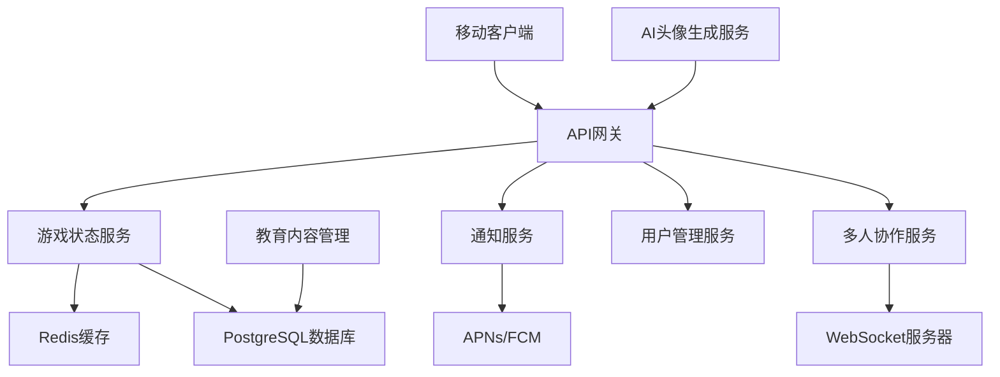

# 设计文档

## 概述

育儿模拟器：硬核父母岗前特训是一款创新的移动端育儿训练应用，采用游戏化机制帮助准父母和新手父母学习育儿技能。系统通过实时状态管理、多人协作和渐进式挑战，提供沉浸式的育儿体验。

核心设计理念：
- **真实性**: 模拟真实育儿场景的时间压力和决策复杂性
- **教育性**: 在游戏过程中传递科学育儿知识
- **协作性**: 支持伴侣间的协作训练
- **渐进性**: 从简单到复杂的技能培养路径

## 架构

### 整体架构



### 技术栈选择

**移动端**:
- iOS: SwiftUI + Combine
- Android: Kotlin + Jetpack Compose
- 跨平台状态管理: 本地SQLite + 云端同步

**后端**:
- API服务: Node.js + Express/Fastify
- 实时通信: Socket.io/WebSocket
- 数据库: PostgreSQL (主数据) + Redis (缓存/会话)
- 消息队列: Redis Pub/Sub

**外部服务**:
- 推送通知: Firebase Cloud Messaging (FCM) + Apple Push Notification Service (APNs)
- AI头像生成: Fal.ai API
- 云存储: AWS S3/CloudFront

## 组件和接口

### 核心组件

#### 1. 游戏状态管理器 (GameStateManager)

```typescript
interface BabyState {
  comfort: number;        // 0-100 舒适度
  parentSanity: number;   // 0-100 父母理智值
  parentingKPI: number;   // 0-100 育儿KPI
  stage: BabyStage;       // 成长阶段
  lastUpdate: Date;
  activeEvents: GameEvent[];
}

interface GameEvent {
  id: string;
  type: EventType;
  severity: number;
  duration: number;
  requiredActions: Action[];
}

class GameStateManager {
  updateState(deltaTime: number): BabyState;
  triggerEvent(eventType: EventType): void;
  processAction(action: Action): ActionResult;
  calculateKPI(): number;
}
```

#### 2. 通知系统 (NotificationSystem)

```typescript
interface NotificationConfig {
  gameMode: GameMode;
  quietHours?: TimeRange;
  maxFrequency: number;
  urgencyThreshold: number;
}

class NotificationSystem {
  scheduleNotification(event: GameEvent, delay: number): void;
  sendUrgentAlert(message: string): void;
  respectQuietMode(config: NotificationConfig): boolean;
  generateContextualMessage(event: GameEvent): string;
}
```

#### 3. 多人协作管理器 (MultiplayerManager)

```typescript
interface GameSession {
  id: string;
  players: Player[];
  sharedState: BabyState;
  mode: MultiplayerMode;
  createdAt: Date;
}

class MultiplayerManager {
  createSession(hostId: string, mode: MultiplayerMode): GameSession;
  joinSession(sessionId: string, playerId: string): boolean;
  syncState(sessionId: string, state: BabyState): void;
  handlePlayerAction(sessionId: string, playerId: string, action: Action): void;
}
```

#### 4. 教育内容系统 (EducationSystem)

```typescript
interface EducationContent {
  id: string;
  trigger: EventType;
  stage: BabyStage;
  title: string;
  content: string;
  tips: string[];
  difficulty: number;
}

class EducationSystem {
  getRelevantContent(event: GameEvent, stage: BabyStage): EducationContent[];
  trackLearningProgress(userId: string, contentId: string): void;
  generatePersonalizedTips(userHistory: UserAction[]): string[];
}
```

### API接口设计

#### 游戏状态API

```typescript
// GET /api/game/state/:userId
interface GameStateResponse {
  state: BabyState;
  availableActions: Action[];
  educationContent?: EducationContent[];
}

// POST /api/game/action
interface ActionRequest {
  userId: string;
  sessionId?: string;
  action: Action;
  timestamp: Date;
}

// WebSocket事件
interface StateUpdateEvent {
  type: 'state_update';
  sessionId: string;
  state: BabyState;
  triggeredBy: string;
}
```

#### 多人协作API

```typescript
// POST /api/multiplayer/session
interface CreateSessionRequest {
  hostId: string;
  mode: MultiplayerMode;
  inviteCode?: string;
}

// POST /api/multiplayer/join
interface JoinSessionRequest {
  sessionId: string;
  playerId: string;
  inviteCode?: string;
}
```

## 数据模型

### 用户数据模型

```sql
-- 用户表
CREATE TABLE users (
  id UUID PRIMARY KEY,
  username VARCHAR(50) UNIQUE NOT NULL,
  email VARCHAR(100) UNIQUE NOT NULL,
  avatar_url TEXT,
  created_at TIMESTAMP DEFAULT NOW(),
  last_active TIMESTAMP DEFAULT NOW()
);

-- 游戏进度表
CREATE TABLE game_progress (
  id UUID PRIMARY KEY,
  user_id UUID REFERENCES users(id),
  current_stage INTEGER DEFAULT 0,
  total_playtime INTEGER DEFAULT 0,
  highest_kpi INTEGER DEFAULT 0,
  achievements JSONB DEFAULT '[]',
  talent_points JSONB DEFAULT '{}',
  created_at TIMESTAMP DEFAULT NOW(),
  updated_at TIMESTAMP DEFAULT NOW()
);

-- 游戏会话表
CREATE TABLE game_sessions (
  id UUID PRIMARY KEY,
  host_id UUID REFERENCES users(id),
  mode VARCHAR(20) NOT NULL,
  state JSONB NOT NULL,
  players JSONB NOT NULL,
  is_active BOOLEAN DEFAULT true,
  created_at TIMESTAMP DEFAULT NOW(),
  ended_at TIMESTAMP
);
```

### 游戏数据模型

```sql
-- 教育内容表
CREATE TABLE education_content (
  id UUID PRIMARY KEY,
  trigger_event VARCHAR(50) NOT NULL,
  baby_stage INTEGER NOT NULL,
  title VARCHAR(200) NOT NULL,
  content TEXT NOT NULL,
  tips JSONB DEFAULT '[]',
  difficulty INTEGER DEFAULT 1,
  created_at TIMESTAMP DEFAULT NOW()
);

-- 用户行为记录表
CREATE TABLE user_actions (
  id UUID PRIMARY KEY,
  user_id UUID REFERENCES users(id),
  session_id UUID,
  action_type VARCHAR(50) NOT NULL,
  response_time INTEGER,
  success BOOLEAN,
  context JSONB,
  timestamp TIMESTAMP DEFAULT NOW()
);
```

## 正确性属性

*属性是一个特征或行为，应该在系统的所有有效执行中保持为真——本质上，是关于系统应该做什么的正式陈述。属性作为人类可读规范和机器可验证正确性保证之间的桥梁。*

基于预工作分析，以下属性经过冗余消除和逻辑合并：

### 属性 1: 核心数值边界不变量
*对于任何* 游戏状态更新操作，所有核心数值(舒适度、理智值、KPI)应该始终保持在0-100的有效范围内
**验证: 需求 1.1, 1.3, 1.5**

### 属性 2: 关键阈值触发机制
*对于任何* 游戏状态，当关键数值达到预定阈值时(舒适度=0触发失败，KPI<50触发警告，理智值过低触发幻觉)，系统应该立即执行相应的响应行为
**验证: 需求 1.2, 1.4, 1.6, 7.4**

### 属性 3: 游戏模式行为一致性
*对于任何* 选定的游戏模式，系统的所有行为(时间同步、通知策略、暂停机制)应该严格遵循该模式的规则定义
**验证: 需求 2.2, 2.4, 2.6, 2.7**

### 属性 4: 通知事件因果关系
*对于任何* 游戏事件触发，通知系统应该根据当前模式设置发送相应通知，且通知内容应该与触发事件完全对应
**验证: 需求 3.1, 3.2, 3.4, 3.5**

### 属性 5: 多人状态同步一致性
*对于任何* 多人游戏会话中的状态变更，所有参与玩家应该在合理延迟内接收到相同的状态更新，且个人表现指标应该独立准确跟踪
**验证: 需求 4.3, 4.4, 4.5**

### 属性 6: 评分计算综合准确性
*对于任何* 影响评分的事件(响应延迟、操作失误、情绪失控)，系统应该准确记录并按照预定义权重计算对KPI分数的影响
**验证: 需求 3.3, 7.1, 7.2, 7.3**

### 属性 7: 成就与天赋解锁条件
*对于任何* 天赋技能或成就，只有当玩家满足预定义的解锁条件时，相应奖励才应该变为可用状态
**验证: 需求 6.2, 6.5**

### 属性 8: 教育内容上下文匹配
*对于任何* 触发的游戏事件，系统返回的教育内容应该与当前婴儿阶段和事件类型完全匹配
**验证: 需求 6.4**

### 属性 9: 数据持久化往返一致性
*对于任何* 游戏进度数据，经过本地存储、云端同步、跨设备恢复的完整流程后，数据应该保持完全一致
**验证: 需求 9.3, 9.5**

### 属性 10: 设备适配响应正确性
*对于任何* 设备特性变化(摇晃手势、屏幕旋转、后台切换)，系统应该正确检测并执行相应的响应行为
**验证: 需求 8.2, 8.3, 8.4, 8.6**

### 属性 11: 特殊模式规则遵循
*对于任何* 特殊游戏模式，系统应该严格按照该模式的独特规则执行，包括非对称信息分发和模式特定的视觉效果
**验证: 需求 5.2, 5.4**

### 属性 12: 界面状态实时反映
*对于任何* 游戏状态变化，用户界面应该实时准确地反映当前的核心数值状态和相应的视觉效果
**验证: 需求 10.2, 10.3**

## 错误处理

### 网络错误处理

**连接中断恢复**:
- 实现指数退避重连机制
- 本地状态缓存，网络恢复后同步
- 离线模式下的基本功能保持

**API调用失败**:
- 重试机制(最多3次)
- 降级服务(使用缓存数据)
- 用户友好的错误提示

### 游戏状态错误

**状态不一致**:
- 服务端权威状态校验
- 客户端状态回滚机制
- 冲突解决策略(服务端优先)

**数据损坏**:
- 状态验证和修复
- 备份状态恢复
- 紧急重置选项

### 多人协作错误

**玩家断线**:
- 自动暂停机制
- 重连等待时间(60秒)
- AI接管断线玩家

**同步失败**:
- 状态回滚到最后一致点
- 重新同步机制
- 会话重建选项

## 测试策略

### 双重测试方法

**单元测试**:
- 专注于具体示例和边界条件
- 测试特定的错误场景
- 验证组件间的集成点
- 覆盖率目标: 80%以上

**属性测试**:
- 验证通用属性在所有输入下成立
- 通过随机化实现全面的输入覆盖
- 每个属性测试最少100次迭代
- 标签格式: **Feature: hardcore-parenting-simulator, Property {number}: {property_text}**

### 测试配置

**属性测试库选择**:
- JavaScript/TypeScript: fast-check
- Swift: SwiftCheck
- Kotlin: KotlinTest Property Testing

**测试环境**:
- 单元测试: Jest + Testing Library
- 集成测试: Cypress/Detox
- 性能测试: Artillery.io
- 负载测试: K6

### 关键测试场景

**游戏机制测试**:
- 状态转换的正确性
- 数值计算的准确性
- 事件触发的时机

**多人协作测试**:
- 并发操作处理
- 网络分区恢复
- 状态同步延迟

**通知系统测试**:
- 不同模式下的行为
- 权限处理
- 批量通知性能

**移动端特性测试**:
- 后台/前台切换
- 设备旋转适配
- 内存压力测试