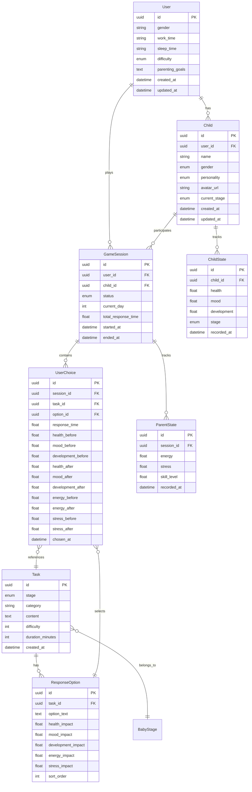

# Design Document: Parenting Simulator Database

## Overview

本设计文档描述育儿模拟器的数据库架构设计。系统采用Supabase（PostgreSQL云服务），使用SQLAlchemy ORM进行数据访问。设计遵循第三范式，确保数据完整性和查询效率。

## Architecture



## Components and Interfaces

### 0. Supabase配置

```python
# backend/app/database/config.py
import os
from supabase import create_client, Client

# Supabase连接配置
SUPABASE_URL = os.getenv("SUPABASE_URL")
SUPABASE_KEY = os.getenv("SUPABASE_KEY")  # service_role key for backend
DATABASE_URL = os.getenv("DATABASE_URL")  # PostgreSQL connection string

def get_supabase_client() -> Client:
    """获取Supabase客户端"""
    return create_client(SUPABASE_URL, SUPABASE_KEY)

# SQLAlchemy连接（用于ORM操作）
from sqlalchemy import create_engine
from sqlalchemy.orm import sessionmaker

engine = create_engine(DATABASE_URL, pool_pre_ping=True)
SessionLocal = sessionmaker(autocommit=False, autoflush=False, bind=engine)

def get_db():
    db = SessionLocal()
    try:
        yield db
    finally:
        db.close()
```

### 1. 枚举类型定义

```python
from enum import Enum

class BabyStage(str, Enum):
    """孩子成长阶段"""
    NEWBORN = "newborn"      # 0-3月 生理需求
    INFANT = "infant"        # 4-12月 安全探索
    TODDLER = "toddler"      # 1-3岁 情绪行为
    PRESCHOOLER = "preschooler"  # 4-5岁 社交教育

class Gender(str, Enum):
    """性别"""
    MALE = "male"
    FEMALE = "female"

class Personality(str, Enum):
    """孩子性格类型"""
    CALM = "calm"           # 安静型
    ACTIVE = "active"       # 活泼型
    CURIOUS = "curious"     # 好奇型
    SENSITIVE = "sensitive" # 敏感型
    SOCIAL = "social"       # 社交型

class Difficulty(str, Enum):
    """游戏难度"""
    BEGINNER = "beginner"
    STANDARD = "standard"
    CHALLENGE = "challenge"

class SessionStatus(str, Enum):
    """会话状态"""
    ACTIVE = "active"
    PAUSED = "paused"
    COMPLETED = "completed"
```

### 2. 数据库模型接口

```python
# 基础模型接口
class BaseModel:
    id: UUID
    created_at: datetime
    updated_at: datetime

# 用户模型
class UserModel(BaseModel):
    gender: Optional[Gender]
    work_time: Optional[str]
    sleep_time: Optional[str]
    difficulty: Difficulty
    parenting_goals: Optional[str]

# 孩子模型
class ChildModel(BaseModel):
    user_id: UUID
    name: str
    gender: Gender
    personality: Personality
    avatar_url: Optional[str]
    current_stage: BabyStage

# 孩子状态模型
class ChildStateModel:
    id: UUID
    child_id: UUID
    health: float  # 0-100
    mood: float    # 0-100
    development: float  # 0-100
    stage: BabyStage
    recorded_at: datetime

# 任务模型
class TaskModel:
    id: UUID
    stage: BabyStage
    category: str
    content: str
    difficulty: int  # 1-5
    duration_minutes: int
    created_at: datetime

# 回应选项模型
class ResponseOptionModel:
    id: UUID
    task_id: UUID
    option_text: str
    health_impact: float  # -20 to +20
    mood_impact: float
    development_impact: float
    energy_impact: float  # 对父母精力的影响
    stress_impact: float  # 对父母压力的影响
    sort_order: int

# 父母状态模型
class ParentStateModel:
    id: UUID
    session_id: UUID
    energy: float  # 0-100 精力值
    stress: float  # 0-100 压力值
    skill_level: float  # 0-100 育儿技能熟练度
    recorded_at: datetime

# 游戏会话模型
class GameSessionModel:
    id: UUID
    user_id: UUID
    child_id: UUID
    status: SessionStatus
    current_day: int
    total_response_time: float
    started_at: datetime
    ended_at: Optional[datetime]

# 用户选择模型
class UserChoiceModel:
    id: UUID
    session_id: UUID
    task_id: UUID
    option_id: UUID
    response_time: float
    health_before: float
    mood_before: float
    development_before: float
    health_after: float
    mood_after: float
    development_after: float
    energy_before: float
    energy_after: float
    stress_before: float
    stress_after: float
    chosen_at: datetime
```

### 3. Repository接口

```python
class UserRepository:
    def create(user: UserCreate) -> User
    def get_by_id(user_id: UUID) -> Optional[User]
    def update(user_id: UUID, data: UserUpdate) -> User
    def delete(user_id: UUID) -> bool

class ChildRepository:
    def create(child: ChildCreate) -> Child
    def get_by_id(child_id: UUID) -> Optional[Child]
    def get_by_user(user_id: UUID) -> List[Child]
    def update(child_id: UUID, data: ChildUpdate) -> Child
    def delete(child_id: UUID) -> bool

class ChildStateRepository:
    def create(state: ChildStateCreate) -> ChildState
    def get_latest(child_id: UUID) -> Optional[ChildState]
    def get_history(child_id: UUID, limit: int) -> List[ChildState]
    def get_by_session(session_id: UUID) -> List[ChildState]

class TaskRepository:
    def create(task: TaskCreate) -> Task
    def get_by_stage(stage: BabyStage) -> List[Task]
    def get_random_by_stage(stage: BabyStage) -> Optional[Task]
    def get_with_options(task_id: UUID) -> TaskWithOptions

class GameSessionRepository:
    def create(session: SessionCreate) -> GameSession
    def get_active(user_id: UUID) -> Optional[GameSession]
    def update_progress(session_id: UUID, day: int) -> GameSession
    def complete(session_id: UUID) -> GameSession

class ParentStateRepository:
    def create(state: ParentStateCreate) -> ParentState
    def get_latest(session_id: UUID) -> Optional[ParentState]
    def get_history(session_id: UUID, limit: int) -> List[ParentState]
    def get_aggregates(session_id: UUID) -> ParentStateAggregates

class UserChoiceRepository:
    def create(choice: ChoiceCreate) -> UserChoice
    def get_by_session(session_id: UUID) -> List[UserChoice]
    def get_statistics(session_id: UUID) -> ChoiceStatistics
```

## Data Models

### 1. SQLAlchemy模型定义

```python
from sqlalchemy import Column, String, Float, Integer, Enum, ForeignKey, DateTime, Text, CheckConstraint
from sqlalchemy.dialects.postgresql import UUID
from sqlalchemy.orm import relationship
import uuid

class User(Base):
    __tablename__ = "users"
    
    id = Column(UUID(as_uuid=True), primary_key=True, default=uuid.uuid4)
    gender = Column(Enum(Gender), nullable=True)
    work_time = Column(String(50), nullable=True)
    sleep_time = Column(String(50), nullable=True)
    difficulty = Column(Enum(Difficulty), default=Difficulty.STANDARD)
    parenting_goals = Column(Text, nullable=True)
    created_at = Column(DateTime, default=datetime.utcnow)
    updated_at = Column(DateTime, default=datetime.utcnow, onupdate=datetime.utcnow)
    
    children = relationship("Child", back_populates="user", cascade="all, delete-orphan")
    sessions = relationship("GameSession", back_populates="user", cascade="all, delete-orphan")

class Child(Base):
    __tablename__ = "children"
    
    id = Column(UUID(as_uuid=True), primary_key=True, default=uuid.uuid4)
    user_id = Column(UUID(as_uuid=True), ForeignKey("users.id", ondelete="CASCADE"), nullable=False)
    name = Column(String(100), nullable=False)
    gender = Column(Enum(Gender), nullable=False)
    personality = Column(Enum(Personality), nullable=False)
    avatar_url = Column(String(500), nullable=True)
    current_stage = Column(Enum(BabyStage), default=BabyStage.NEWBORN)
    created_at = Column(DateTime, default=datetime.utcnow)
    updated_at = Column(DateTime, default=datetime.utcnow, onupdate=datetime.utcnow)
    
    user = relationship("User", back_populates="children")
    states = relationship("ChildState", back_populates="child", cascade="all, delete-orphan")
    sessions = relationship("GameSession", back_populates="child", cascade="all, delete-orphan")

class ChildState(Base):
    __tablename__ = "child_states"
    
    id = Column(UUID(as_uuid=True), primary_key=True, default=uuid.uuid4)
    child_id = Column(UUID(as_uuid=True), ForeignKey("children.id", ondelete="CASCADE"), nullable=False)
    health = Column(Float, nullable=False)
    mood = Column(Float, nullable=False)
    development = Column(Float, nullable=False)
    stage = Column(Enum(BabyStage), nullable=False)
    recorded_at = Column(DateTime, default=datetime.utcnow)
    
    __table_args__ = (
        CheckConstraint('health >= 0 AND health <= 100', name='health_range'),
        CheckConstraint('mood >= 0 AND mood <= 100', name='mood_range'),
        CheckConstraint('development >= 0 AND development <= 100', name='development_range'),
    )
    
    child = relationship("Child", back_populates="states")

class Task(Base):
    __tablename__ = "tasks"
    
    id = Column(UUID(as_uuid=True), primary_key=True, default=uuid.uuid4)
    stage = Column(Enum(BabyStage), nullable=False, index=True)
    category = Column(String(50), nullable=False)
    content = Column(Text, nullable=False)
    difficulty = Column(Integer, default=1)
    duration_minutes = Column(Integer, default=5)
    created_at = Column(DateTime, default=datetime.utcnow)
    
    options = relationship("ResponseOption", back_populates="task", cascade="all, delete-orphan")

class ResponseOption(Base):
    __tablename__ = "response_options"
    
    id = Column(UUID(as_uuid=True), primary_key=True, default=uuid.uuid4)
    task_id = Column(UUID(as_uuid=True), ForeignKey("tasks.id", ondelete="CASCADE"), nullable=False)
    option_text = Column(Text, nullable=False)
    health_impact = Column(Float, default=0)
    mood_impact = Column(Float, default=0)
    development_impact = Column(Float, default=0)
    energy_impact = Column(Float, default=0)  # 对父母精力的影响
    stress_impact = Column(Float, default=0)  # 对父母压力的影响
    sort_order = Column(Integer, default=0)
    
    task = relationship("Task", back_populates="options")

class ParentState(Base):
    __tablename__ = "parent_states"
    
    id = Column(UUID(as_uuid=True), primary_key=True, default=uuid.uuid4)
    session_id = Column(UUID(as_uuid=True), ForeignKey("game_sessions.id", ondelete="CASCADE"), nullable=False)
    energy = Column(Float, nullable=False)
    stress = Column(Float, nullable=False)
    skill_level = Column(Float, nullable=False)
    recorded_at = Column(DateTime, default=datetime.utcnow)
    
    __table_args__ = (
        CheckConstraint('energy >= 0 AND energy <= 100', name='energy_range'),
        CheckConstraint('stress >= 0 AND stress <= 100', name='stress_range'),
        CheckConstraint('skill_level >= 0 AND skill_level <= 100', name='skill_level_range'),
    )
    
    session = relationship("GameSession", back_populates="parent_states")

class GameSession(Base):
    __tablename__ = "game_sessions"
    
    id = Column(UUID(as_uuid=True), primary_key=True, default=uuid.uuid4)
    user_id = Column(UUID(as_uuid=True), ForeignKey("users.id", ondelete="CASCADE"), nullable=False)
    child_id = Column(UUID(as_uuid=True), ForeignKey("children.id", ondelete="CASCADE"), nullable=False)
    status = Column(Enum(SessionStatus), default=SessionStatus.ACTIVE)
    current_day = Column(Integer, default=1)
    total_response_time = Column(Float, default=0)
    started_at = Column(DateTime, default=datetime.utcnow)
    ended_at = Column(DateTime, nullable=True)
    
    user = relationship("User", back_populates="sessions")
    child = relationship("Child", back_populates="sessions")
    choices = relationship("UserChoice", back_populates="session", cascade="all, delete-orphan")
    parent_states = relationship("ParentState", back_populates="session", cascade="all, delete-orphan")

class UserChoice(Base):
    __tablename__ = "user_choices"
    
    id = Column(UUID(as_uuid=True), primary_key=True, default=uuid.uuid4)
    session_id = Column(UUID(as_uuid=True), ForeignKey("game_sessions.id", ondelete="CASCADE"), nullable=False)
    task_id = Column(UUID(as_uuid=True), ForeignKey("tasks.id"), nullable=False)
    option_id = Column(UUID(as_uuid=True), ForeignKey("response_options.id"), nullable=False)
    response_time = Column(Float, nullable=False)
    health_before = Column(Float, nullable=False)
    mood_before = Column(Float, nullable=False)
    development_before = Column(Float, nullable=False)
    health_after = Column(Float, nullable=False)
    mood_after = Column(Float, nullable=False)
    development_after = Column(Float, nullable=False)
    energy_before = Column(Float, nullable=False)
    energy_after = Column(Float, nullable=False)
    stress_before = Column(Float, nullable=False)
    stress_after = Column(Float, nullable=False)
    chosen_at = Column(DateTime, default=datetime.utcnow)
    
    session = relationship("GameSession", back_populates="choices")
    task = relationship("Task")
    option = relationship("ResponseOption")
```

### 2. 索引设计

```sql
-- 用户查询优化
CREATE INDEX idx_users_created_at ON users(created_at);

-- 孩子查询优化
CREATE INDEX idx_children_user_id ON children(user_id);
CREATE INDEX idx_children_current_stage ON children(current_stage);

-- 状态历史查询优化
CREATE INDEX idx_child_states_child_id ON child_states(child_id);
CREATE INDEX idx_child_states_recorded_at ON child_states(recorded_at DESC);
CREATE INDEX idx_child_states_child_recorded ON child_states(child_id, recorded_at DESC);

-- 任务查询优化
CREATE INDEX idx_tasks_stage ON tasks(stage);
CREATE INDEX idx_tasks_stage_category ON tasks(stage, category);

-- 会话查询优化
CREATE INDEX idx_game_sessions_user_id ON game_sessions(user_id);
CREATE INDEX idx_game_sessions_status ON game_sessions(status);
CREATE INDEX idx_game_sessions_user_status ON game_sessions(user_id, status);

-- 选择记录查询优化
CREATE INDEX idx_user_choices_session_id ON user_choices(session_id);
CREATE INDEX idx_user_choices_chosen_at ON user_choices(chosen_at);

-- 父母状态查询优化
CREATE INDEX idx_parent_states_session_id ON parent_states(session_id);
CREATE INDEX idx_parent_states_recorded_at ON parent_states(recorded_at DESC);
```


## Correctness Properties

*A property is a characteristic or behavior that should hold true across all valid executions of a system—essentially, a formal statement about what the system should do. Properties serve as the bridge between human-readable specifications and machine-verifiable correctness guarantees.*

### Property 1: Round-trip Persistence

*For any* valid model object (User, Child, ChildState, Task, ResponseOption, GameSession, UserChoice), saving it to the database and then loading it back should produce an object with equivalent field values.

**Validates: Requirements 1.1, 1.3, 2.1, 4.1, 4.3, 4.5, 5.1, 5.3, 6.1**

### Property 2: Unique ID Generation

*For any* collection of created entities of the same type, all generated UUIDs should be distinct from each other.

**Validates: Requirements 1.2**

### Property 3: Timestamp Auto-generation

*For any* newly created entity with timestamp fields, the created_at timestamp should be set automatically and be less than or equal to the current time. For updated entities, updated_at should be greater than or equal to created_at.

**Validates: Requirements 1.2, 2.4**

### Property 4: Foreign Key Integrity

*For any* entity with a foreign key reference, the referenced entity must exist in the database. Attempting to create an entity with an invalid foreign key reference should raise an integrity error.

**Validates: Requirements 2.2, 5.2, 7.1, 7.5**

### Property 5: Enum Validation

*For any* field defined as an enum type (difficulty, gender, personality, stage, status), only values from the defined enum set should be accepted. Invalid enum values should be rejected.

**Validates: Requirements 1.4, 2.3, 2.5, 3.4, 6.3**

### Property 6: Value Range Constraints

*For any* ChildState record, the health, mood, and development values must be between 0 and 100 inclusive. Values outside this range should be rejected by the database.

**Validates: Requirements 3.1, 7.3**

### Property 7: State History Preservation

*For any* sequence of state changes for a child, all state records should be preserved in the database with their original timestamps, and the count of state records should equal the number of state changes made.

**Validates: Requirements 3.2, 3.3**

### Property 8: Latest State Query Correctness

*For any* child with multiple state records, querying for the latest state should return the record with the most recent recorded_at timestamp.

**Validates: Requirements 3.5**

### Property 9: Task-Option Relationship

*For any* task with associated response options, querying options by task_id should return all and only the options that were created for that task. Filtering tasks by stage should return all and only tasks with that stage.

**Validates: Requirements 4.2, 4.4**

### Property 10: Session Choice Query

*For any* game session with recorded choices, querying choices by session_id should return all and only the choices made in that session, preserving the order by chosen_at timestamp.

**Validates: Requirements 5.4**

### Property 11: Active Session Query

*For any* user with multiple sessions in different statuses, querying for active sessions should return all and only sessions with status=ACTIVE.

**Validates: Requirements 6.5**

### Property 12: Cascade Delete

*For any* user that is deleted, all associated children, game sessions, child states, and user choices should also be deleted. After deletion, querying for these related entities should return empty results.

**Validates: Requirements 7.2**

### Property 13: Aggregation Correctness

*For any* set of ChildState records for a child, the computed average, min, and max values for health, mood, and development should match the mathematically correct values calculated from the raw data.

**Validates: Requirements 8.2, 8.3**

### Property 14: Session Completion State

*For any* game session that is marked as completed, the ended_at timestamp should be set and should be greater than or equal to started_at.

**Validates: Requirements 6.2, 6.4**

## Error Handling

### Database Connection Errors

```python
class DatabaseError(Exception):
    """Base database error"""
    pass

class ConnectionError(DatabaseError):
    """Database connection failed"""
    pass

class IntegrityError(DatabaseError):
    """Data integrity constraint violated"""
    pass

class NotFoundError(DatabaseError):
    """Requested entity not found"""
    pass
```

### Error Handling Strategy

1. **Connection Failures**: Implement retry logic with exponential backoff (3 retries, 1s/2s/4s delays)
2. **Integrity Violations**: Return descriptive error messages indicating which constraint was violated
3. **Not Found**: Return None or raise NotFoundError depending on context
4. **Validation Errors**: Validate data at application layer before database operations

### Constraint Violation Handling

```python
def handle_integrity_error(error: Exception) -> str:
    """Convert database integrity errors to user-friendly messages"""
    error_str = str(error).lower()
    
    if "foreign key" in error_str:
        return "Referenced entity does not exist"
    if "unique" in error_str:
        return "Duplicate entry not allowed"
    if "check" in error_str:
        if "health" in error_str or "mood" in error_str or "development" in error_str:
            return "Value must be between 0 and 100"
    return "Data validation failed"
```

## Testing Strategy

### Unit Tests

Unit tests focus on specific examples and edge cases:

1. **Model Creation Tests**
   - Create each model type with valid data
   - Verify all fields are set correctly
   - Test default values

2. **Constraint Tests**
   - Test enum field with invalid values
   - Test numeric fields at boundary values (0, 100, -1, 101)
   - Test required fields with null values

3. **Relationship Tests**
   - Test cascade delete behavior
   - Test foreign key constraint violations

### Property-Based Tests

Property-based tests verify universal properties across randomly generated inputs. Use `hypothesis` library for Python.

**Configuration**:
- Minimum 100 iterations per property test
- Each test tagged with: **Feature: parenting-simulator-database, Property {N}: {property_text}**

**Test Implementation Pattern**:

```python
from hypothesis import given, strategies as st, settings
import pytest

# Custom strategies for domain objects
user_strategy = st.builds(
    UserCreate,
    gender=st.sampled_from(list(Gender)),
    difficulty=st.sampled_from(list(Difficulty)),
    work_time=st.text(min_size=0, max_size=50),
    sleep_time=st.text(min_size=0, max_size=50),
    parenting_goals=st.text(min_size=0, max_size=500)
)

child_state_strategy = st.builds(
    ChildStateCreate,
    health=st.floats(min_value=0, max_value=100),
    mood=st.floats(min_value=0, max_value=100),
    development=st.floats(min_value=0, max_value=100),
    stage=st.sampled_from(list(BabyStage))
)

# Feature: parenting-simulator-database, Property 1: Round-trip Persistence
@settings(max_examples=100)
@given(user_data=user_strategy)
def test_user_round_trip(db_session, user_data):
    """For any valid User, save then load should produce equivalent object"""
    repo = UserRepository(db_session)
    created = repo.create(user_data)
    loaded = repo.get_by_id(created.id)
    
    assert loaded is not None
    assert loaded.gender == user_data.gender
    assert loaded.difficulty == user_data.difficulty
    assert loaded.work_time == user_data.work_time

# Feature: parenting-simulator-database, Property 6: Value Range Constraints
@settings(max_examples=100)
@given(
    health=st.floats(min_value=-100, max_value=200),
    mood=st.floats(min_value=-100, max_value=200),
    development=st.floats(min_value=-100, max_value=200)
)
def test_state_value_constraints(db_session, health, mood, development):
    """For any state values, only 0-100 range should be accepted"""
    valid = all(0 <= v <= 100 for v in [health, mood, development])
    
    if valid:
        # Should succeed
        state = create_child_state(db_session, health, mood, development)
        assert state is not None
    else:
        # Should raise IntegrityError
        with pytest.raises(IntegrityError):
            create_child_state(db_session, health, mood, development)
```

### Integration Tests

1. **Full Workflow Test**: Create user → Create child → Start session → Make choices → Complete session → Generate report
2. **Concurrent Access Test**: Multiple sessions accessing same data
3. **Migration Test**: Verify schema migrations work correctly

### Test Database Setup

```python
@pytest.fixture
def db_session():
    """Create a fresh database session for each test"""
    engine = create_engine("sqlite:///:memory:")
    Base.metadata.create_all(engine)
    Session = sessionmaker(bind=engine)
    session = Session()
    yield session
    session.close()
```
