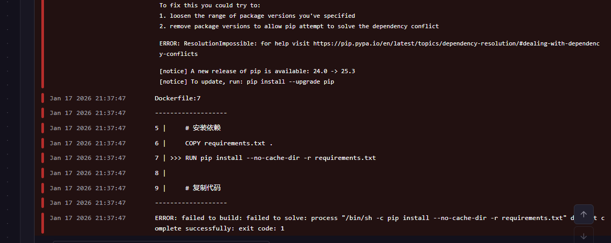

# Implementation Plan: Parenting Simulator Database

## Overview

将育儿模拟器从JSON文件存储迁移到Supabase（PostgreSQL云服务）。使用SQLAlchemy ORM实现数据模型，创建Repository层进行数据访问，并编写属性测试验证正确性。

## Tasks

- [x] 1. 设置Supabase数据库基础架构
  - [x] 1.1 配置Supabase连接
    - 创建 `backend/app/database/config.py` 配置Supabase连接
    - 添加环境变量：SUPABASE_URL, SUPABASE_KEY, DATABASE_URL
    - 更新 `backend/.env.example` 添加Supabase配置模板
    - _Requirements: 10.1, 10.2, 10.4_
  
  - [x] 1.2 创建数据库会话管理
    - 创建 `backend/app/database/session.py` 管理数据库会话
    - 支持连接池和会话生命周期管理
    - _Requirements: 8.1, 10.4_
  
  - [x] 1.3 创建枚举类型定义
    - 创建 `backend/app/models/enums.py`
    - 定义 BabyStage, Gender, Personality, Difficulty, SessionStatus 枚举
    - _Requirements: 1.4, 2.3, 2.5, 6.3_

- [x] 2. 实现核心数据模型
  - [x] 2.1 创建User模型
    - 创建 `backend/app/models/user.py`
    - 实现用户表：id, gender, work_time, sleep_time, difficulty, parenting_goals, timestamps
    - _Requirements: 1.1, 1.2, 1.3, 1.4_
  
  - [x] 2.2 创建Child模型
    - 创建 `backend/app/models/child.py`
    - 实现孩子表：id, user_id(FK), name, gender, personality, avatar_url, current_stage, timestamps
    - 配置与User的关系和级联删除
    - _Requirements: 2.1, 2.2, 2.3, 2.4, 2.5_
  
  - [x] 2.3 创建ChildState模型
    - 创建 `backend/app/models/child_state.py`
    - 实现状态表：id, child_id(FK), health, mood, development, stage, recorded_at
    - 添加CheckConstraint确保值在0-100范围
    - _Requirements: 3.1, 3.2, 3.3, 3.4_
  
  - [ ]* 2.4 编写属性测试：值范围约束
    - **Property 6: Value Range Constraints**
    - **Validates: Requirements 3.1, 7.3**

- [x] 3. 实现父母状态和任务系统模型
  - [x] 3.1 创建ParentState模型
    - 创建 `backend/app/models/parent_state.py`
    - 实现父母状态表：id, session_id(FK), energy, stress, skill_level, recorded_at
    - 添加CheckConstraint确保值在0-100范围
    - _Requirements: 7.1, 7.2, 7.3, 7.4, 7.5_
  
  - [x] 3.2 创建Task模型
    - 创建 `backend/app/models/task.py`
    - 实现任务表：id, stage, category, content, difficulty, duration_minutes, created_at
    - 添加stage索引优化查询
    - _Requirements: 4.1, 4.4, 4.5_
  
  - [x] 3.3 创建ResponseOption模型
    - 创建 `backend/app/models/response_option.py`
    - 实现选项表：id, task_id(FK), option_text, health_impact, mood_impact, development_impact, energy_impact, stress_impact, sort_order
    - 配置与Task的关系
    - _Requirements: 4.2, 4.3_

- [x] 4. 实现游戏会话模型
  - [x] 4.1 创建GameSession模型
    - 创建 `backend/app/models/game_session.py`
    - 实现会话表：id, user_id(FK), child_id(FK), status, current_day, total_response_time, started_at, ended_at
    - 配置与User和Child的关系
    - _Requirements: 6.1, 6.2, 6.3, 6.4, 6.5_
  
  - [x] 4.2 创建UserChoice模型
    - 创建 `backend/app/models/user_choice.py`
    - 实现选择表：id, session_id(FK), task_id(FK), option_id(FK), response_time, before/after状态值（含energy, stress）, chosen_at
    - _Requirements: 5.1, 5.2, 5.3, 5.4_
  
  - [x] 4.3 创建模型索引文件
    - 创建 `backend/app/models/__init__.py` 导出所有模型
    - 确保所有关系正确配置

- [x] 5. Checkpoint - 验证模型定义
  - Ensure all models are correctly defined, ask the user if questions arise.

- [x] 6. 实现Repository层
  - [x] 6.1 创建UserRepository
    - 创建 `backend/app/repositories/user_repository.py`
    - 实现 create, get_by_id, update, delete 方法
    - _Requirements: 1.1, 1.2, 7.2_
  
  - [x] 6.2 创建ChildRepository
    - 创建 `backend/app/repositories/child_repository.py`
    - 实现 create, get_by_id, get_by_user, update, delete 方法
    - _Requirements: 2.1, 2.2_
  
  - [x] 6.3 创建ChildStateRepository
    - 创建 `backend/app/repositories/child_state_repository.py`
    - 实现 create, get_latest, get_history, get_aggregates 方法
    - _Requirements: 3.3, 3.5, 8.2, 8.3_
  
  - [ ]* 6.4 编写属性测试：最新状态查询
    - **Property 8: Latest State Query Correctness**
    - **Validates: Requirements 3.5**
  
  - [x] 6.5 创建TaskRepository
    - 创建 `backend/app/repositories/task_repository.py`
    - 实现 create, get_by_stage, get_random_by_stage, get_with_options 方法
    - _Requirements: 4.1, 4.4_
  
  - [x] 6.6 创建GameSessionRepository
    - 创建 `backend/app/repositories/game_session_repository.py`
    - 实现 create, get_active, update_progress, complete 方法
    - _Requirements: 6.1, 6.4, 6.5_
  
  - [x] 6.7 创建ParentStateRepository
    - 创建 `backend/app/repositories/parent_state_repository.py`
    - 实现 create, get_latest, get_history, get_aggregates 方法
    - _Requirements: 7.1, 7.4, 7.5, 9.2_
  
  - [x] 6.8 创建UserChoiceRepository
    - 创建 `backend/app/repositories/user_choice_repository.py`
    - 实现 create, get_by_session, get_statistics 方法
    - _Requirements: 5.1, 5.4, 9.3_
  
  - [x] 6.9 创建Repository索引文件
    - 创建 `backend/app/repositories/__init__.py` 导出所有Repository

- [x] 7. Checkpoint - 验证Repository实现
  - Ensure all repositories work correctly, ask the user if questions arise.

- [x] 8. 实现数据库迁移和初始化
  - [x] 8.1 创建Supabase数据库初始化脚本
    - 创建 `backend/app/database/init_db.py`
    - 实现表创建和初始数据导入
    - 生成Supabase SQL迁移文件
    - _Requirements: 8.1, 10.1_
  
  - [x] 8.2 创建任务种子数据
    - 创建 `backend/app/database/seed_tasks.py`
    - 为每个阶段创建示例任务和回应选项（含energy_impact, stress_impact）
    - _Requirements: 4.1, 4.2_

- [ ] 9. 编写核心属性测试
  - [ ]* 9.1 编写属性测试：数据往返持久化
    - **Property 1: Round-trip Persistence**
    - **Validates: Requirements 1.1, 1.3, 2.1, 4.1, 4.3, 4.5, 5.1, 5.3, 6.1**
  
  - [ ]* 9.2 编写属性测试：外键完整性
    - **Property 4: Foreign Key Integrity**
    - **Validates: Requirements 2.2, 5.2, 7.1, 7.5**
  
  - [ ]* 9.3 编写属性测试：级联删除
    - **Property 12: Cascade Delete**
    - **Validates: Requirements 7.2**
  
  - [ ]* 9.4 编写属性测试：聚合计算正确性
    - **Property 13: Aggregation Correctness**
    - **Validates: Requirements 9.2, 9.3**

- [ ] 10. 更新现有服务层
  - [-] 10.1 更新DataStore服务
    - 修改 `backend/app/services/data_store.py`
    - 使用Repository替代JSON文件操作
    - 添加父母状态管理方法
    - 保持API兼容性
    - _Requirements: 1.1, 3.3, 5.1, 7.1_
  
  - [ ] 10.2 更新ReportGenerator服务
    - 修改 `backend/app/services/report_generator.py`
    - 使用数据库查询替代JSON数据读取
    - 添加父母状态统计到报告
    - _Requirements: 9.2, 9.3_

- [ ] 11. Final Checkpoint - 完整功能验证
  - Ensure all tests pass and the system works end-to-end with Supabase, ask the user if questions arise.

## Notes

- Tasks marked with `*` are optional and can be skipped for faster MVP
- Each task references specific requirements for traceability
- Checkpoints ensure incremental validation
- Property tests validate universal correctness properties
- Unit tests validate specific examples and edge cases
